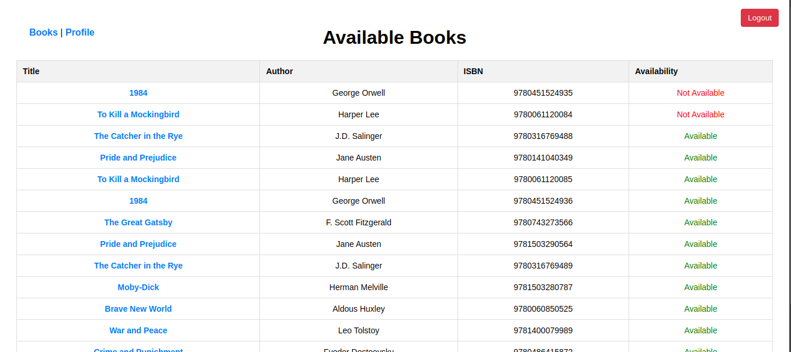

# BookLibrary

BookLibrary is a Ruby on Rails application for managing a library system. This guide will help you install the application, run it, and execute the test suite.

## Installation

### Prerequisites

- **Ruby** (version 3.4.1 or later)
- **Rails** (version 8.x recommended)
- **Bundler**
- **SQLite3** (or another supported database)

### Steps

1. **Clone the Repository**
   ```bash
   https://github.com/JAPH254/simple-book-lending.git
   cd book_library

2. **Install Dependencies**

   ```bash
   bundle install

3. **run the database migrations**

   ```bash
   rails db:migrate

4. **Seed the database**
   ```bash
   rails db:seed

5. **Start the Rails server**

   ```bash
   rails server

6. **Open your web browser and navigate to `http://localhost:3000` to see the application in action.**

7. Run All Tests
   ```bash
   bundle exec rspec

8. **Run Specific Tests**
   ```bash
   bundle exec rspec spec/controllers/books_controller_spec.rb
   ```

9. Troubleshooting

If you're using Spring, stop it before running tests:
```bash
spring stop
```

10. Navigating the application


this is the landing page. If you have not signed in, youll be resirected to the login. simply create an account and login to see the books.

Woouoow. Feel free to navigate through your application. Enjoy your reading! 😊


This README provides clear instructions on installation, running the app, and executing tests.I am finishing on all the failing tests. I am at the implementation and testing phase. I will continue to work on the implementation and testing until all tests pass. Thank you for your patience and understanding.😊 Let me know if you need any further modifications!

